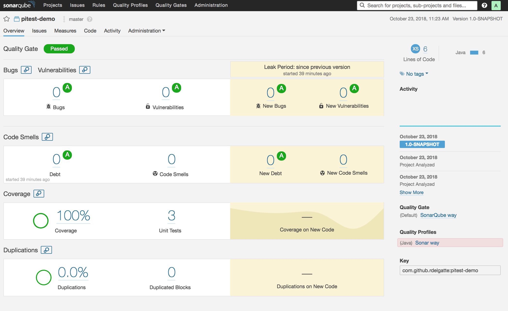
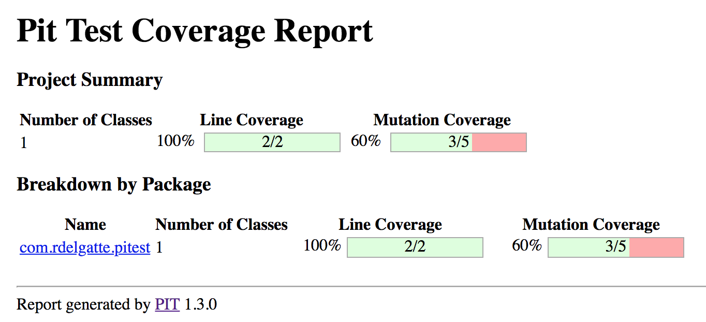
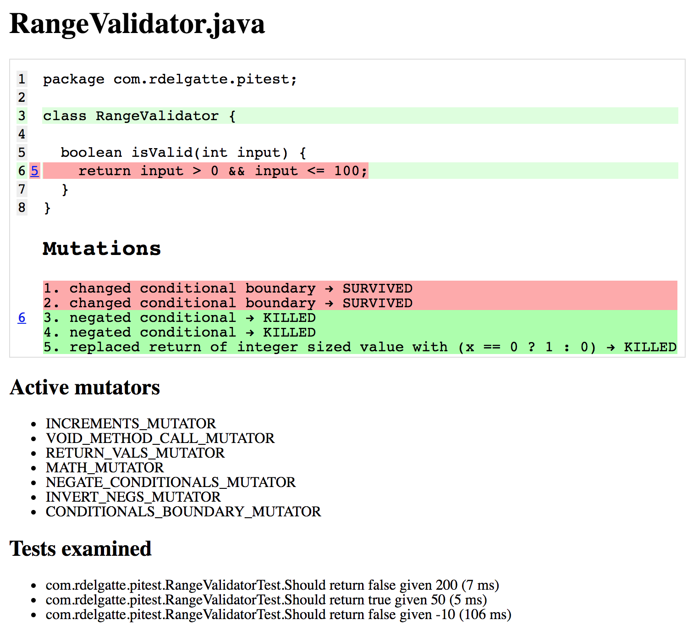
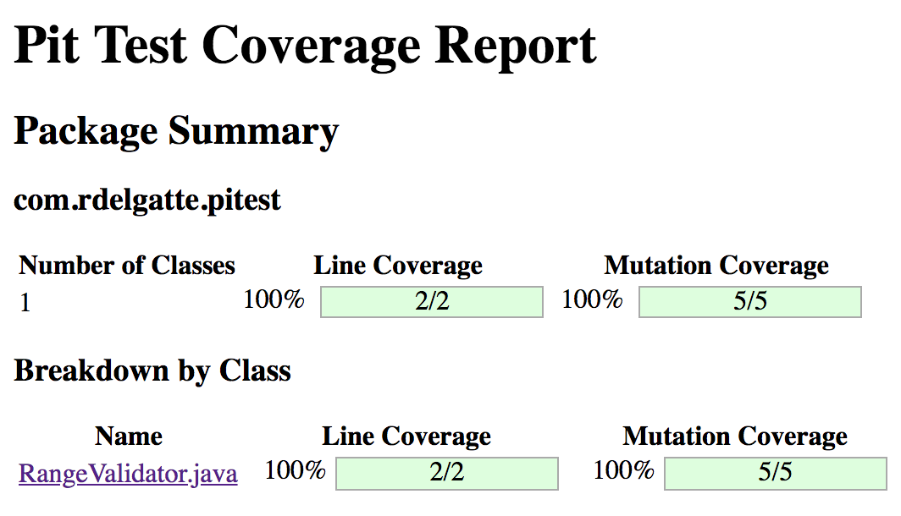
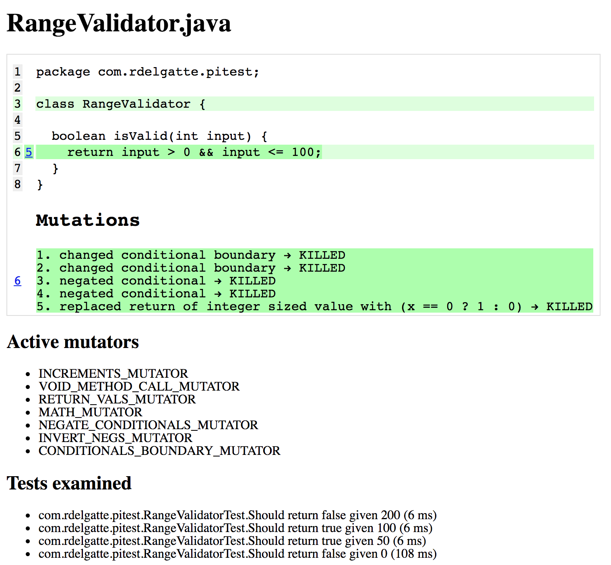

# Mutation testing with Pitest

This basic project aims to highlight benefits of mutation testing in Java using [Pitest](http://pitest.org)

## RangeValidator
It assesses whether a provided input number is between 0 and 100 like below: 

```
boolean isValid(int input) {
  return input > 0 && input <= 100;
}
```

#### 1) Initial state (`git checkout step-0`)
In this step, we can notice that our code is fully covered by unit tests:


*Jacoco report*


*Sonar report*

But when looking at the unit tests, we can notice they are assessing nothing:
```
  @Test
  @DisplayName("Should return true given 50")
  void fifty_isValid_returnsTrue() {
    cut.isValid(50);
  }

  @Test
  @DisplayName("Should return false given 200")
  void twoHundred_isValid_returnsFalse() {
    cut.isValid(200);
  }

  @Test
  @DisplayName("Should return false given -10")
  void minus10_isValid_returnsTrue() {
    cut.isValid(-10);
  }
```

Both line and branch coverage are reporting a 100% unit tests covering but nothing is being tested really!!

#### Adding assertions (`git checkout step-1`)
Let's assert that use cases!

```
  @Test
  @DisplayName("Should return true given 50")
  void fifty_isValid_returnsTrue() {
    assertThat(cut.isValid(50)).isTrue();
  }

  @Test
  @DisplayName("Should return false given 200")
  void twoHundred_isValid_returnsFalse() {
    assertThat(cut.isValid(200)).isFalse();
  }

  @Test
  @DisplayName("Should return false given -10")
  void minus10_isValid_returnsTrue() {
    assertThat(cut.isValid(-10)).isFalse();
  }
```

Ok we do feel better now right? Reports from Sonar / Jacoco still look good with 100% code coverage reporting but can we go further?

#### Mutation testing (`git checkout step-2`)
Let's talk about mutation testing!

Adding Pitest to our `pom.xml` file: 
```
<plugin>
  <groupId>org.pitest</groupId>
  <artifactId>pitest-maven</artifactId>
  <version>${pitest.maven.version}</version>
  <dependencies>
    <dependency>
      <groupId>org.pitest</groupId>
      <artifactId>pitest-junit5-plugin</artifactId>
      <version>0.3</version>
    </dependency>
  </dependencies>
  <configuration>
    <outputFormats>
      <outputFormat>XML</outputFormat>
      <outputFormat>HTML</outputFormat>
    </outputFormats>
    <targetClasses>
      <param>com.rdelgatte.pitest.*</param>
    </targetClasses>
    <targetTests>
      <param>com.rdelgatte.pitest.*</param>
    </targetTests>
    <exportLineCoverage>true</exportLineCoverage>
    <!--We want each report to override the former one-->
    <timestampedReports>false</timestampedReports>
  </configuration>
</plugin>
```

- Run pitest mutation coverage using `mvn test pitest:mutationCoverage`
- Look at Pitest report (see `console` or `target/pit-reports/index.html` file)



*Pitest report*

Here we can notice the line coverage is still 100% but a new coverage has been introduced here: `Mutation Coverage`


*Pitest detailed report*

Pitest executed tests after mutating our original source code and discovered some mutations are not handled by unit tests so we need to fix that. 

To do so, we should cover cases including limit test case which means when provided value is either 0 and 100.

Following are the test cases to cover mutation testing: 
```
  @Test
  @DisplayName("Should return true given 50")
  void fifty_isValid_returnsTrue() {
    assertThat(cut.isValid(50)).isTrue();
  }

  @Test
  @DisplayName("Should return false given 200")
  void twoHundred_isValid_returnsFalse() {
    assertThat(cut.isValid(200)).isFalse();
  }

  @Test
  @DisplayName("Should return true given 100")
  void hundred_isValid_returnsTrue() {
    assertThat(cut.isValid(100)).isTrue();
  }

  @Test
  @DisplayName("Should return false given 0")
  void zero_isValid_returnsFalse() {
    assertThat(cut.isValid(0)).isFalse();
  }
```

Running again Pitest mutation coverage command and looking at its report, we can notice bot line and mutation coverage look 100% good:


*Pitest report*


*Pitest detailed report*


You can see more about this case (step by step) in the following [introduction to Mutation Testing](https://rdelgatte.github.io/pitest-presentation/).
 
